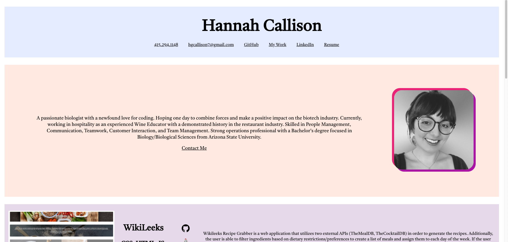
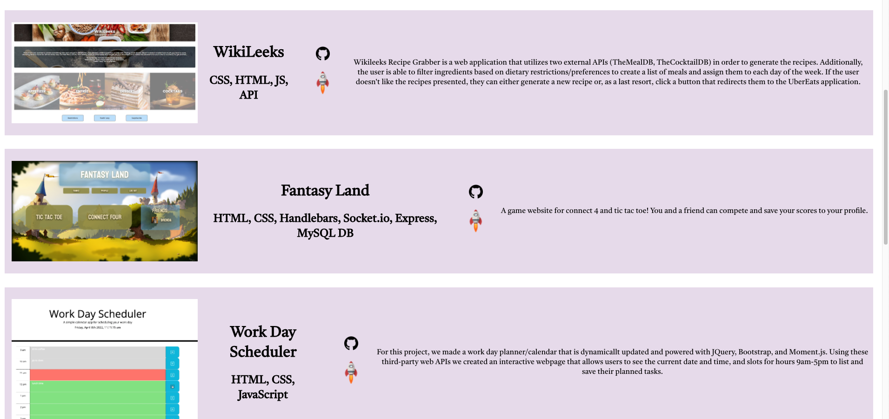
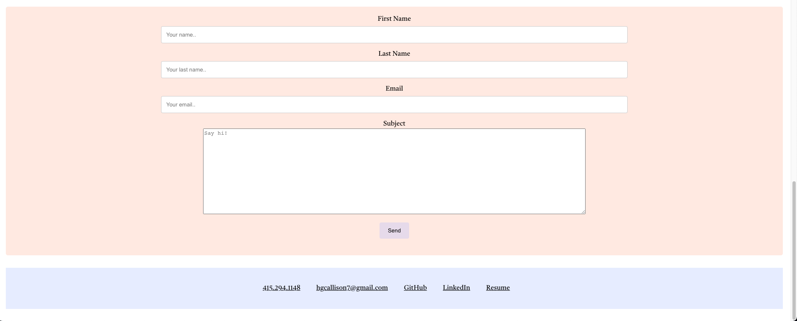

# React Portfolio

## Introduction

For this project we were given the task of building a portfolio website from scratch using React. The purpose of our portfolio is to showcase our projects and skills to potential employers. With our HTML, Advanced CSS skills and React we were tasked with building a responsive webpage that interacts with the user.

## Usage

Click the corresponding links to be taken to my Github, LinkedIn, and resume. If you click my phone number or email the browser will initiate contact. 

**I also have the links for my projects disquised as icons in each project card.** 

The **GitHub icon will take you to the repository for that project.**, 

The **Rocket icon will take you to the deployed link**. 

The contact form at the bottom has a submit button for users to press once they have entered in the required information. 

# Getting Started with Create React App

This project was bootstrapped with [Create React App](https://github.com/facebook/create-react-app).

## Available Scripts

In the project directory, you can run:

### `npm start`

Runs the app in the development mode.\
Open [http://localhost:3000](http://localhost:3000) to view it in your browser.

The page will reload when you make changes.\
You may also see any lint errors in the console.

## Product

Attached below are screenshots of the final webpage

**Link to published webpage**:

 https://young-journey-29344.herokuapp.com/
